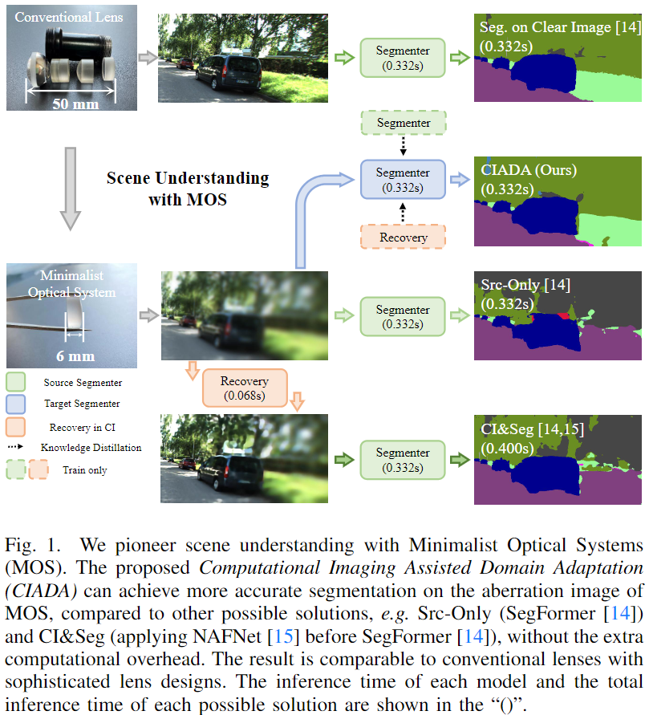
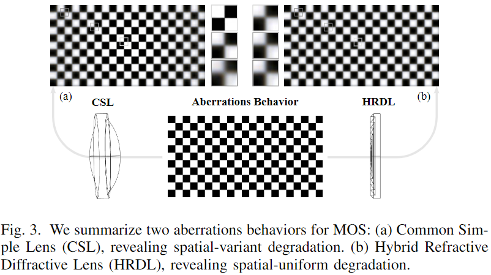
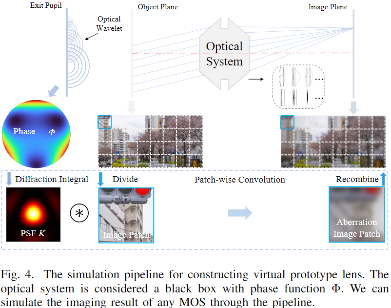
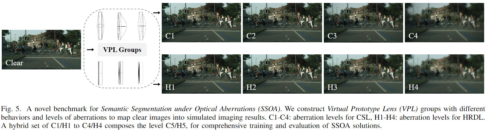
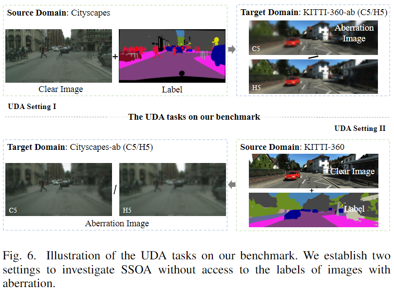
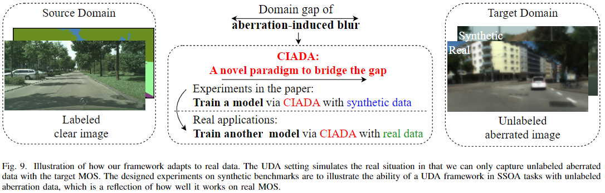
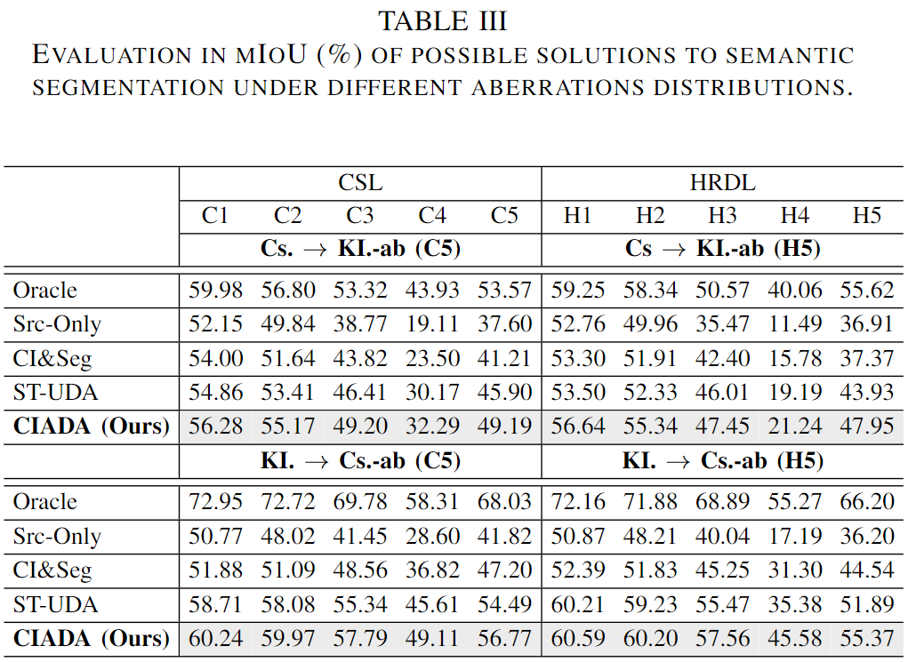
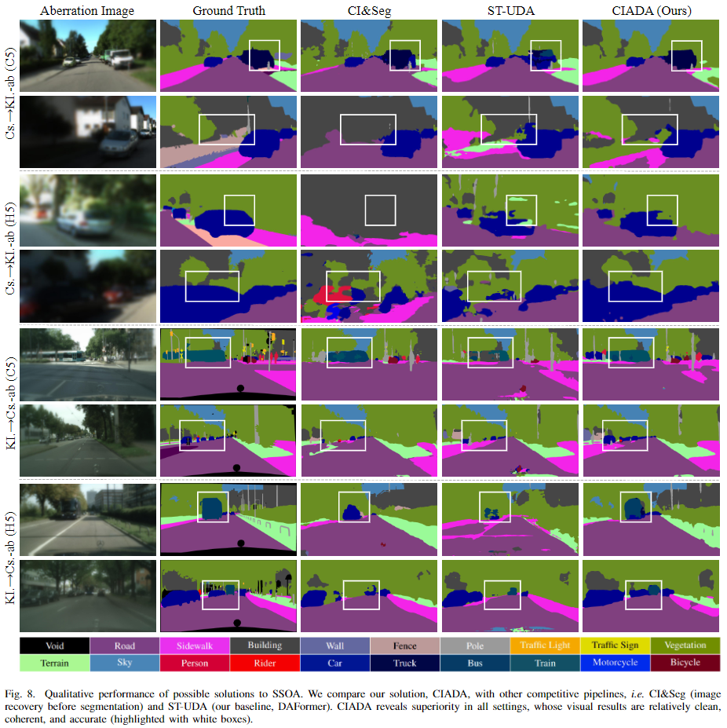
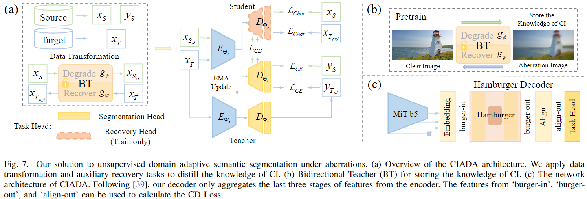

# CIADA

### [Paper](https://ieeexplore.ieee.org/document/10493068) |   [Appendix](https://ieeexplore.ieee.org/ielx7/6745852/10398876/10493068/supp1-3380363.pdf?arnumber=10493068)

> **Computational Imaging for Machine Perception: Transferring Semantic Segmentation Beyond Aberrations** <br>
> [Qi Jiang\*](https://github.com/zju-jiangqi), [Hao Shi*](https://github.com/MasterHow), Shaohua Gao, and [Jiaming Zhang](https://jamycheung.github.io). <br>
> Our paper has been accepted by IEEE Transactions on Computational Imaging (TCI).

### Abstract

Semantic scene understanding with Minimalist Optical Systems (MOS) in mobile and wearable applications remains a challenge due to the corrupted imaging quality induced by optical aberrations. However, previous works only focus on improving the subjective imaging quality through the Computational Imaging (CI) technique, ignoring the feasibility of advancing semantic segmentation. In this paper, we pioneer the investigation of Semantic Segmentation under Optical Aberrations (SSOA) with MOS. To benchmark SSOA, we construct Virtual Prototype Lens (VPL) groups through optical simulation, generating Cityscapes-ab and KITTI-360-ab datasets under different behaviors and levels of aberrations. We look into SSOA via an unsupervised domain adaptation perspective to address the scarcity of labeled aberration data in real-world scenarios. Further, we propose Computational Imaging Assisted Domain Adaptation (CIADA) to leverage prior knowledge of CI for robust performance in SSOA. Based on our benchmark, we conduct experiments on the robustness of classical segmenters against aberrations. In addition, extensive evaluations of possible solutions to SSOA reveal that CIADA achieves superior performance under all aberration distributions, bridging the gap between computational imaging and downstream applications for MOS.

Overall, we investigate the important and interesting problem that the "optimal" image obtained by CI pipeline may not be suitable for downstream visual tasks:



In our work, we propose to perform CI for machine perception, rather than human observation, i.e., performing Semantic Segmentation task directly on the raw aberrated data of Minimalist Optical Systems (MOS). 

### The proposed datasets and tasks
In this paper, we pioneer the investigation of Semantic Segmentation under Optical Aberrations (SSOA) with MOS. To benchmark SSOA, we construct Virtual Prototype Lens (VPL) groups through optical simulation, generating Cityscapes-ab and KITTI-360-ab datasets under different behaviors and levels of aberrations.
We summarize aberration behaviors of MOS: Common Simple Lens (CSL, i.e. spatial-variant degradation) and Hybrid Refractive Diffractive Lens (HRDL, i.e. spatial-
uniform degradation), and construct Virtual Prototype Lens (VPL) groups to produce simulated imaging results of different MOS. VPL groups contain randomly generated aberration distributions of four levels for CSL and HRDL, respectively. Specifically, we create Cityscapes-ab and KITTI-360-ab to benchmark semantic segmentation under various optical aberrations.



The generated datasets Cityscapes-ab and KITTI-360-ab are available at our [Baidu Disk](https://pan.baidu.com/s/1O1zT3dHIxn4IXR1w03EUtg?pwd=hv4n).
Our datasets can benchmark the Domain Adaptive SSOA task set up in the paper, which can bypass the synthetic-to-real gap problem caused by supervised training on aberrated data. 
The illustration of the task:



### Possible Solutions to SSOA
Without access to labeled aberration images, UDA is a preferred solution to SSOA. Similar to some semantic segmentation tasks in bad weather, powerful domain adaptive semantic segmentation framework (e.g. [DAFormer](https://github.com/lhoyer/DAFormer) or [HRDA](https://github.com/lhoyer/HRDA)) can be used to solve SSOA problems. By replacing the datasets with ours (Cityscapes to KITTI-360-ab or KITTI-360 to Cityscapes-ab) in their projects ([DAFormer](https://github.com/lhoyer/DAFormer) or [HRDA](https://github.com/lhoyer/HRDA)), good SSOA results will be achieved:



We also provide the results of CI&Seg (restoration before segmentation), whose results are limited although with additional computational overhead of a restoration model.
Moreover, the Computational Imaging Assisted Domain Adaptation (CIADA) framework is delivered as the superior solution to SSOA. We propose to leverage the CI pipeline as an auxiliary task to perform knowledge distillation for the SSOA task. 

More details can be found in our paper and appendix.
We hope that our work will inspire more research on the use of aberrated images of MOS for downstream visual tasks, and we believe that the idea of VPL will benefit the data preparation of these tasks.

### Citation
```
@article{jiang2024computational,
  title={Computational Imaging for Machine Perception: Transferring Semantic Segmentation Beyond Aberrations},
  author={Jiang, Qi and Shi, Hao and Gao, Shaohua and Zhang, Jiaming and Yang, Kailun and Sun, Lei and Ni, Huajian and Wang, Kaiwei},
  journal={IEEE Transactions on Computational Imaging},
  volume={10},
  pages={535--548},
  year={2024},
  publisher={IEEE}
}
```

### Contact
If you have any questions or are interested in the VPL generation, please contact me via `qijiang@zju.edu.cn`.
